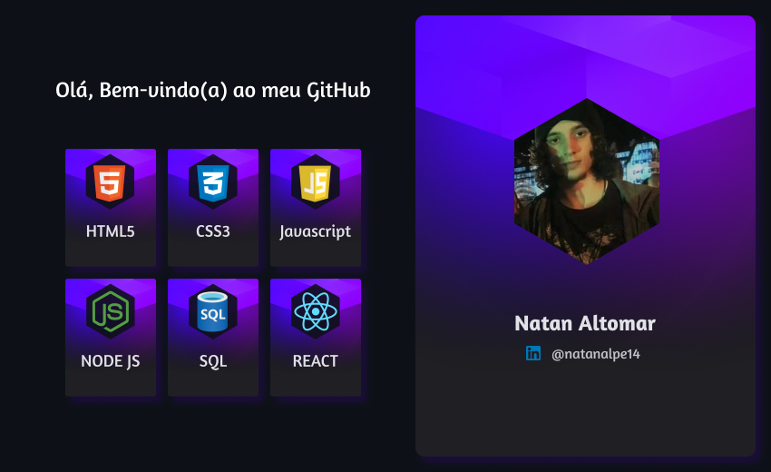

<a style="margin:0 15px 0 0" href="https://github.com/Natanalpe" disabled>Dark mode</a>
<a style="margin:0 15px 0 10px" href="README.LIGHT.md">Light mode</a>
<a style="margin:0 0 0 15px" href="README.FDARK.md">Night mode</a>

- - -

